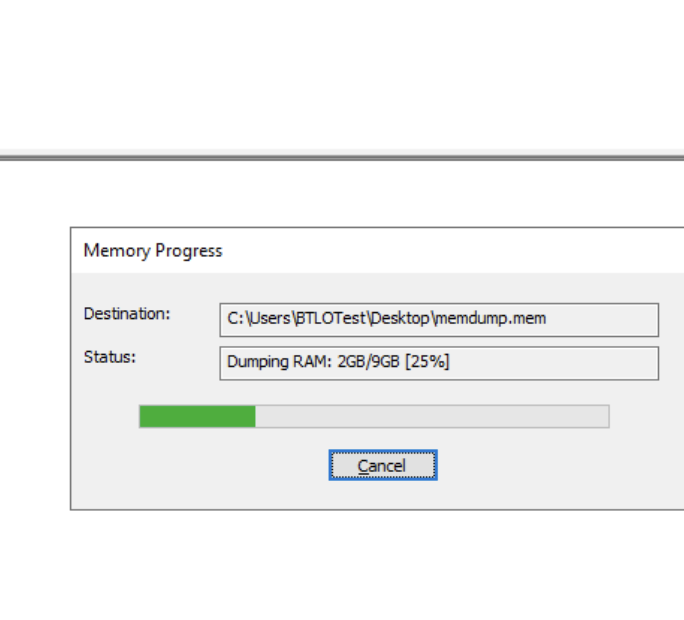
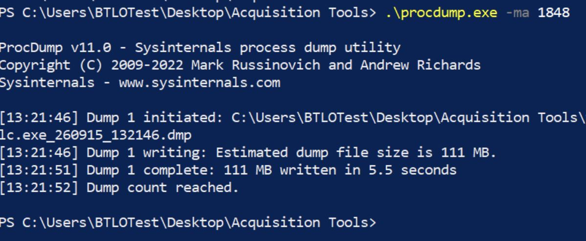
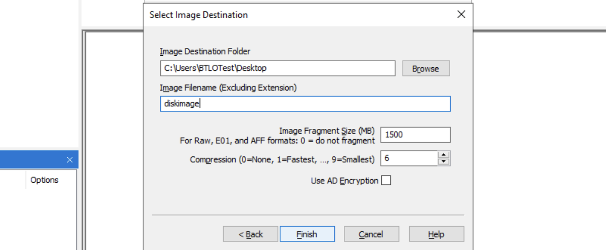
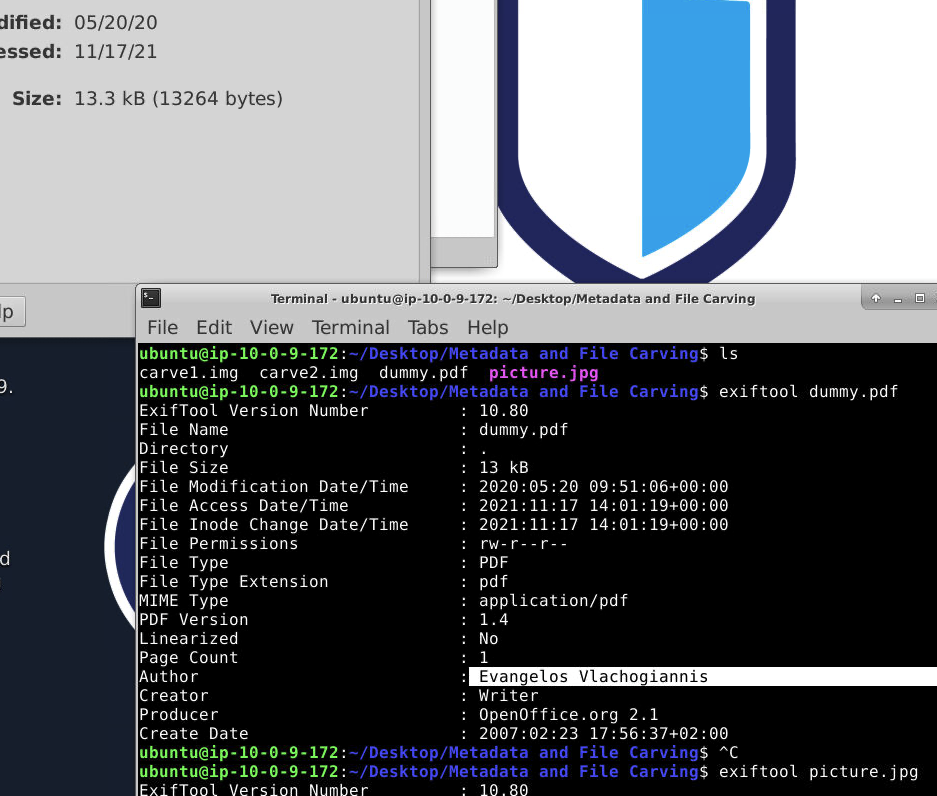
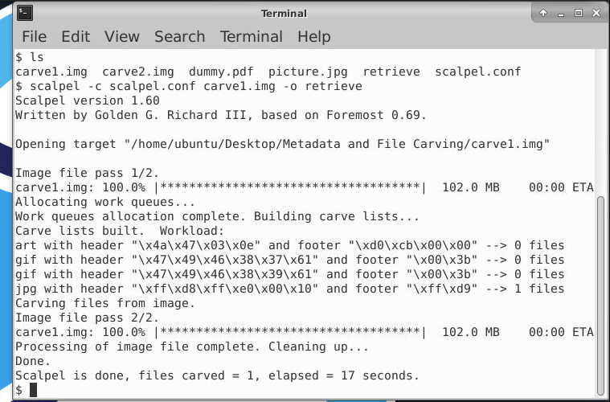
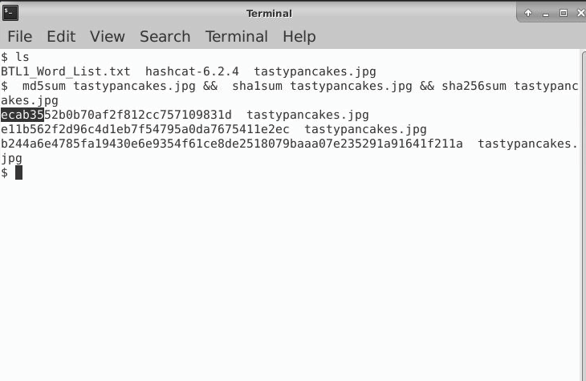

# Forensic Evidence Acquisition and Recovery

## Investigative Question

**How can an examiner acquire evidence at the appropriate scope, verify what was collected, identify its structure, and recover useful content while preserving the limits of each method?**

This project consolidates several controlled digital-forensics exercises into one evidence-handling workflow. The emphasis is on method selection, integrity, recovery, and defensible interpretation rather than reproducing individual lab tasks.

## Evidence and Scope

The work covered several separate training evidence sources and acquisition scopes:

- whole-system volatile memory;
- one selected process;
- a physical disk acquired as E01;
- targeted live/remote Windows artifacts with KAPE;
- supplied filesystem images used for classification and carving;
- document and image files used for metadata analysis.

These sources are **not presented as one incident**. They demonstrate complementary forensic methods.

## Tools

- **FTK Imager 4.5.0.3** — memory capture, physical-disk imaging, image verification, filesystem inspection
- **ProcDump 11.0** — process-specific memory capture
- **KAPE 1.2.0.0** — targeted artifact collection
- **ExifTool 12.80** — embedded metadata extraction
- **Scalpel 1.60** — signature-based file carving
- **Linux / PowerShell hashing utilities** — MD5, SHA-1, and SHA-256 where required

## Investigative Workflow

```text
Identify the evidence question
        ↓
Choose acquisition scope
        ├── whole RAM
        ├── single process
        ├── physical disk
        └── targeted artifacts
        ↓
Verify acquisition where supported
        ↓
Identify filesystem / evidence structure
        ↓
Examine metadata and allocated content
        ↓
Recover deleted/non-obvious content where justified
        ↓
Hash outputs
        ↓
Document observations, limits, and next actions
```

## Findings and Operational Interpretation

### 1. Acquisition scope should match the question

Whole-memory acquisition preserves broad volatile state. A process dump narrows collection to one process when a PID-level lead already exists. A physical image preserves persistent disk evidence. KAPE provides rapid targeted collection when speed or remote triage matters.

Operationally:

```text
Full image
→ breadth

Targeted collection
→ speed

Neither automatically replaces the other.
```

### 2. Acquisition verification matters

The E01 workflow produced matching internal verification hashes and reported no bad blocks.

A matching verification digest supports byte-for-byte consistency of the acquired evidence data. It does **not** prove that the original source was authentic, that every earlier handling step was correct, or that chain of custody was complete.

### 3. Filesystem identification determines the examination strategy

Supplied images were parsed as NTFS, FAT32, and Ext3.

That classification matters because the filesystem determines which metadata structures, allocation records, deleted-file mechanisms, and recovery approaches are available.

### 4. Metadata provides leads, not attribution

ExifTool exposed embedded metadata from supplied files.

Metadata can support questions about document authorship fields, software, timestamps, or device information, but those values can be edited, copied, stripped, or inherited. They are evidence to corroborate, not identity proof.

### 5. File carving can recover content after filesystem references are lost

Scalpel recovered JPEG content by scanning raw image data for configured signatures.

Carving is useful when directory records are deleted or unavailable, but the recovered file may lose:

- original filename;
- path;
- ownership;
- filesystem timestamps;
- complete fragmentation context.

### 6. Hashes identify bytes; they do not validate meaning

The exercises used MD5, SHA-1, and SHA-256 to show how exact byte sequences produce repeatable digests.

For current integrity and identification work, SHA-256 is the preferred primary digest. Legacy hashes may still appear in older tools, labs, and comparison datasets.

```text
matching hash
→ same measured bytes

matching hash
≠ authentic source
≠ truthful content
```

## Evidence Screenshots

Selected screenshots show tool execution and forensic output. Course answer screens are excluded.

### Whole-memory acquisition



### Process-specific acquisition



### E01 imaging configuration



### Metadata examination



### File carving



### Hash generation



## Evidence Boundaries and Limitations

This was a controlled training workflow, not a production forensic case.

The retained evidence has several limitations:

- the separate exercises used different evidence sources;
- a complete external chain-of-custody record was not available;
- write-blocker use was not independently documented for every source;
- SHA-256 was not recorded for every acquisition output;
- complete raw acquisitions and all parser exports are not stored in this repository;
- targeted KAPE collection can miss evidence outside selected targets;
- carved content may lack original filesystem context;
- screenshots demonstrate method execution but do not independently establish incident conclusions.

## Production Follow-Up

In a real case I would:

- record source-device identifiers and acquisition circumstances;
- preserve source and verification hashes using a modern digest;
- retain complete tool logs and manifests;
- document write-blocker status and custody transfers;
- keep originals secured and analyse verified copies;
- validate recovered content with filesystem metadata where possible;
- correlate volatile, disk, and targeted artifacts before reporting conclusions.

## Interview Discussion Points

This project gives me concrete examples for discussing:

- when to prioritize RAM over disk;
- when targeted triage is appropriate and when a full image is still needed;
- why acquisition verification is different from chain of custody;
- why file carving recovers content but often loses context;
- why metadata and hashes must be interpreted within evidentiary limits;
- how to select a collection method based on the investigative question.

## Skills Demonstrated

- forensic acquisition planning
- live-memory acquisition
- process-specific memory capture
- physical-disk imaging
- E01 verification
- targeted Windows artifact collection
- filesystem identification
- metadata extraction
- deleted-file carving
- cryptographic hashing
- evidence-integrity reasoning
- observation-versus-interpretation discipline
- documenting limitations and next justified actions

## References

- SWGDE publications: https://www.swgde.org/documents/published/
- FTK Imager product information: https://www.exterro.com/digital-forensics-software/ftk-imager
- KAPE: https://www.kroll.com/en/insights/publications/cyber/kroll-artifact-parser-extractor-kape
