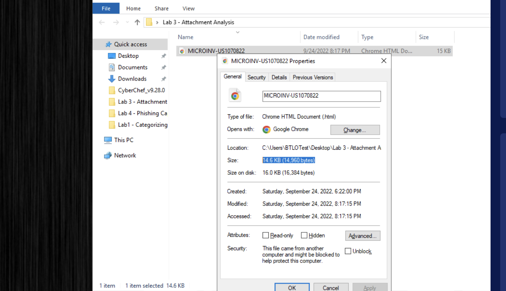
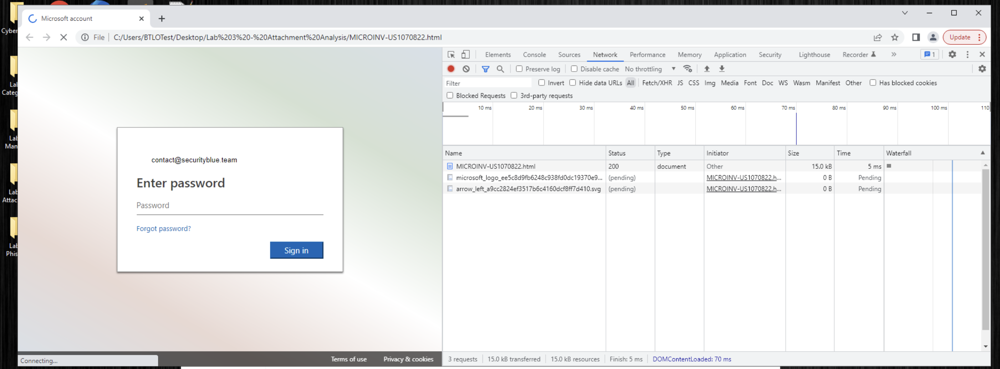
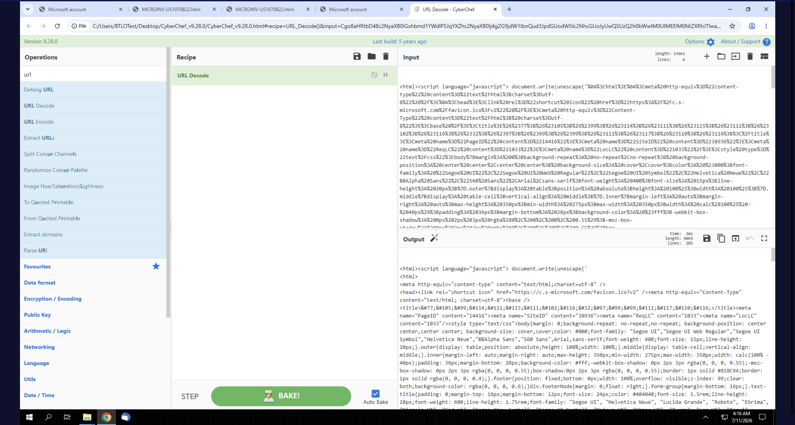
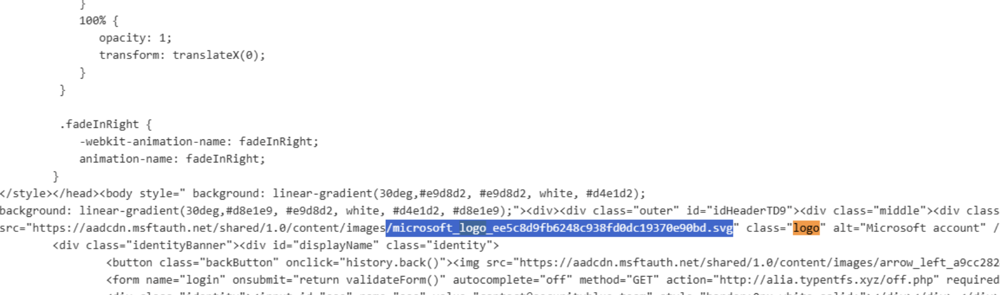
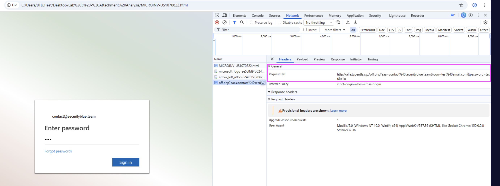

# Investigating an Attachment

## Overview

In this lab, I investigated an HTML attachment used as a credential harvester. Instead of directing the recipient to a phishing website through an email link, the attachment contained an encoded imitation Microsoft sign-in page that attempted to send submitted credentials to an external server.

## Objective

I aimed to identify and document:

- The attachment filename and file type
- The SHA256 hash of the attachment
- The file size
- The organization being impersonated
- The targeted recipient
- The Microsoft logo filename referenced in the source code
- The external request URL used to transmit submitted credentials

## Tools Used

- Windows File Explorer
- Windows PowerShell
- Google Chrome
- Chrome Developer Tools
- CyberChef

## Methodology

### 1. File identification

I inspected the attachment properties in Windows to confirm its full filename, extension, and size.



### 2. File hashing

I generated a SHA256 hash using PowerShell so the attachment could be uniquely identified and compared against threat-intelligence sources without relying on the filename alone.

```powershell
Get-FileHash ".\MICROINV-US1070822.html" -Algorithm SHA256
```

### 3. Visual inspection

I opened the HTML file in the isolated lab environment. The page imitated a Microsoft sign-in portal and contained a pre-filled email address, showing which recipient the phishing attempt targeted.



### 4. Source-code decoding

I viewed the page source and copied it into CyberChef. I applied the `URL Decode` operation to make the encoded HTML easier to inspect.



I then searched the decoded source for `logo` and identified the Microsoft logo asset referenced by the page.



### 5. Network-request inspection

I opened Chrome Developer Tools, selected the Network panel, entered the lab password `test`, and submitted the form. I inspected the resulting request to identify where the page attempted to send the email address and password.



## Findings

| Artifact | Value |
|---|---|
| Attachment filename | `MICROINV-US1070822.html` |
| File type | HTML document (`.html`) |
| File size | `14.6 KB` (`14,960 bytes`) |
| SHA256 | **Pending confirmation** |
| Impersonated organization | Microsoft |
| Targeted recipient | `contact@securityblue.team` |
| Microsoft logo filename | `microsoft_logo_ee5c8d9fb6248c938fd0dc19370e90bd.svg` |
| Credential-collection domain | `alia.typenfts.xyz` |
| Credential-submission endpoint | `/off.php` |

The request URL contained the submitted email address and password as query-string parameters. This means the credentials were placed directly in the URL rather than being sent only in a protected request body.

Defanged request pattern:

```text
hxxps://alia[.]typenfts[.]xyz/off.php?aaa=<email>&ooo=<password>&s1=
```

The observed lab submission used the target email address and the test password supplied in the exercise.

## Analysis

The attachment used several techniques commonly seen in credential-harvesting campaigns:

- It used an HTML attachment rather than placing the phishing URL directly in the email body.
- It copied Microsoft sign-in branding to appear familiar and trustworthy.
- It pre-filled the intended victim's email address to make the page appear personalized.
- It encoded the page source, making casual inspection more difficult.
- It attempted to transmit the entered credentials to an attacker-controlled external domain.

The use of a legitimate Microsoft-hosted logo asset did not make the page legitimate. Attackers can reference genuine public images while the form action still sends credentials to unrelated infrastructure.

## Skills Demonstrated

- HTML attachment analysis
- File-property inspection
- SHA256 hashing with PowerShell
- Credential-harvester identification
- Safe source-code inspection
- URL decoding with CyberChef
- HTML asset and form-action analysis
- Browser network-request analysis
- IOC extraction and URL defanging

## Outcome

I identified the attachment as an HTML credential harvester impersonating Microsoft. I extracted the targeted recipient, the referenced logo filename, the credential-collection domain, and the submission endpoint. The lab demonstrated how an apparently local HTML attachment can still communicate with external infrastructure and expose submitted credentials.

## Safety Note

The attachment was examined only inside the controlled BTL1 lab environment. The credential-collection URL is defanged in this report, and no live phishing file is included in the repository.