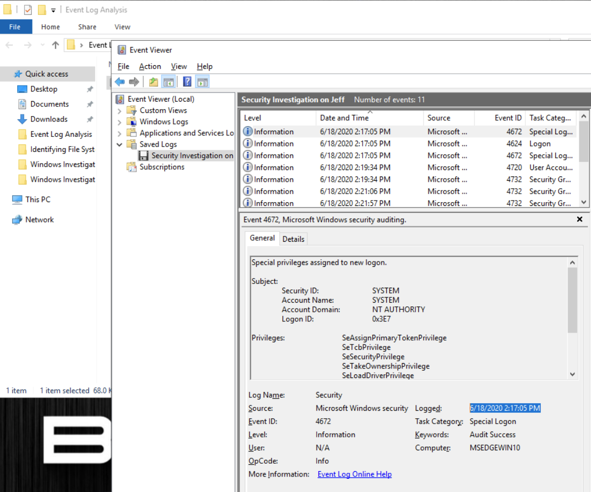
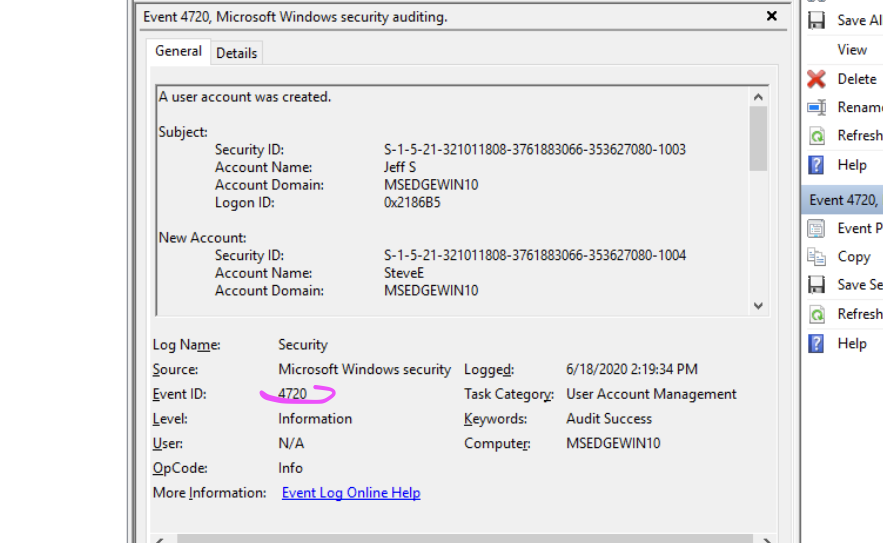
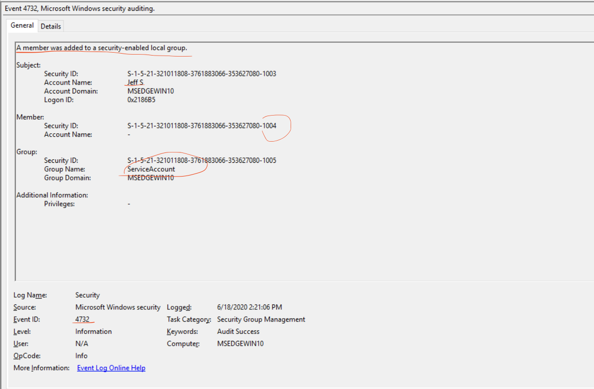
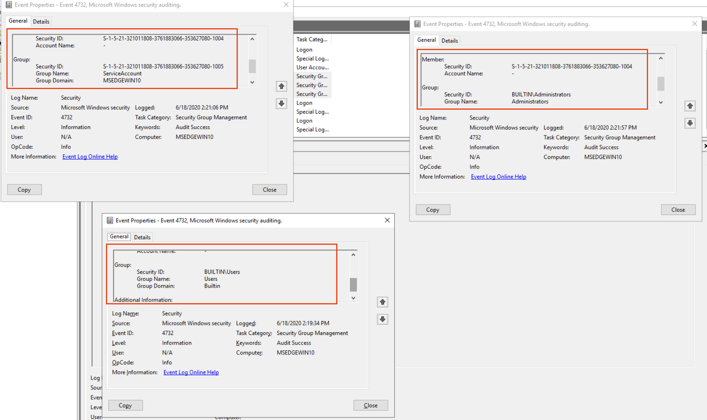
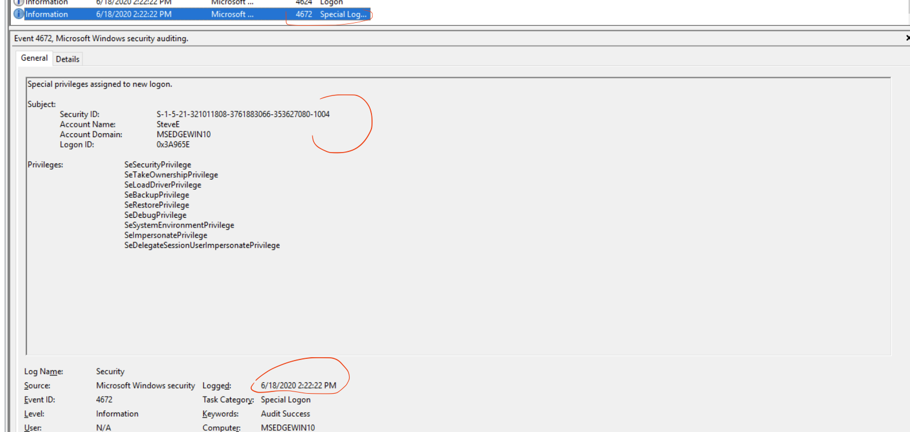

# Windows Security Event Account-Activity Investigation

## Investigative Question

**Can Windows Security events reconstruct suspicious account creation, privilege changes, group membership, and subsequent logon activity?**

This project converts a controlled Windows Event Log exercise into an analyst-focused investigation. The objective is not to memorize Event IDs, but to show how event type, timestamp, SID, subject/member fields, and Logon ID can be correlated into an evidence-backed sequence of account activity.

## Evidence and Scope

The supplied evidence was a Windows Security event-log export (`.evtx`) from a controlled training environment.

The retained evidence supported analysis of:

- successful logons;
- special-privilege assignment;
- user-account creation;
- local security-group membership changes;
- SID-based identity correlation;
- chronological reconstruction.

The evidence set was intentionally small and does not represent a complete endpoint or enterprise investigation.

## Tool

- **Windows Event Viewer**
- Windows Security auditing events

## Investigative Workflow

```text
Suspicious employee activity
        ↓
Open Security EVTX
        ↓
Order events chronologically
        ↓
Identify account-creation event
        ↓
Record actor + new account + SID
        ↓
Follow the SID through group changes
        ↓
Identify later successful logon
        ↓
Correlate privileged-session evidence
        ↓
Document what the sequence supports
```

## Findings

### 1. Privileged activity preceded the account creation

The earliest relevant event in the retained sequence was Event ID **4672**, indicating that sensitive privileges were assigned to a new logon session.

Operationally, 4672 is not itself proof of malicious activity. Its value is that it identifies a session with sensitive privileges and provides a **Logon ID** that can be correlated with a successful logon event such as 4624.

### 2. A new local account was created

Event ID **4720** recorded the creation of the account:

```text
New account: SteveE
```

The event's **Subject** identified **Jeff S** as the account requesting the creation operation.

The important distinction is:

```text
Subject
→ actor requesting the change

New Account
→ account being created
```

The new account was assigned a Windows Security Identifier ending in:

```text
...-1004
```

That SID became the most useful identity pivot for the remainder of the investigation.

### 3. The SID linked the new account to later group changes

Event ID **4732** recorded additions to security-enabled local groups.

The same member SID associated with the newly created account appeared in later 4732 events, even where the account-name field was not populated.

This allowed the account to be followed through membership changes involving:

- **Users**
- **ServiceAccount**
- **Administrators**

Operationally, this demonstrates why the SID is often more reliable for correlation than a display name alone:

```text
account name
= human-readable label

SID
= Windows security principal identifier
```

For Event 4732, the field roles are also important:

```text
Subject → who made the change
Member  → who/what was added
Group   → destination group
```

The addition to the local **Administrators** group is security-significant because it changes the account's privilege context. It is an investigative lead, not by itself proof of compromise.

### 4. The new account subsequently logged on

Later events showed the newly created account successfully establishing a session.

The relevant relationship is:

```text
4624
→ successful logon

4672
→ sensitive privileges assigned to that new logon
```

A 4672 event should not be treated as a replacement for 4624. The events answer different questions and can be correlated using the **Logon ID**.

### 5. SID and Logon ID solve different correlation problems

This lab produced two particularly useful analyst pivots:

```text
SID
→ follow a security principal across different actions

Logon ID
→ follow one specific logon session across related events
```

That distinction is transferable to real Windows investigations.

## Event IDs Used

| Event ID | Operational Meaning |
|---|---|
| **4624** | A logon session was successfully created |
| **4672** | Sensitive privileges were assigned to a new logon |
| **4720** | A user account was created |
| **4732** | A member was added to a security-enabled local group |

These identifiers are useful because they answer different investigative questions. The analyst still has to correlate fields, time, identity, and surrounding activity.

## Evidence Screenshots

Selected screenshots show the analyst-visible Windows Security evidence used to reconstruct the sequence. Course question/answer screens are excluded.

### First privileged logon evidence



### Account creation



### Group-management sequence



### Group membership correlation



### Subsequent privileged logon



## Operational Interpretation

The strongest result was not any individual Event ID. It was the reconstructed sequence:

```text
privileged session exists
        ↓
Jeff S creates SteveE
        ↓
SteveE SID established
        ↓
same SID added to local groups
        ↓
same account gains Administrators membership
        ↓
SteveE successfully logs on
        ↓
new session receives sensitive privileges
```

That sequence provides a defensible starting point for a deeper investigation.

## What the Evidence Supports

The retained events support that:

- Windows recorded Jeff S as the subject requesting creation of SteveE;
- the SID assigned to SteveE can be correlated with subsequent local-group additions;
- that account was added to Users, ServiceAccount, and Administrators;
- the account later established a successful logon session;
- sensitive privileges were assigned to that later session.

## What the Evidence Does Not Prove

The events do **not** establish by themselves:

- why the account was created;
- that the account creation was unauthorized;
- that the human Jeff personally performed the action;
- that membership in Administrators was malicious;
- what SteveE did after logging on;
- whether malware, remote access, or credential compromise was involved.

Those questions require additional telemetry.

## Production Follow-Up

If this were a real SOC investigation, the next justified pivots would include:

- correlate 4624 using **Logon Type**, source IP, workstation, and Logon ID;
- inspect process creation telemetry such as Security 4688, Sysmon Event ID 1, or EDR process data;
- review PowerShell logging;
- inspect network connections from the host;
- look for additional account-management changes;
- determine whether the Jeff S and SteveE activity fits approved administrative workflow;
- correlate with identity, VPN, endpoint, and SIEM telemetry.

## Interview Discussion Points

This project provides concrete examples for explaining:

- why Event IDs are starting points rather than conclusions;
- the difference between **Subject**, **Member**, and **Group** fields;
- why a SID can correlate an account when the display name is missing;
- how a Logon ID ties events to a specific session;
- why 4624 and 4672 should be interpreted together rather than treated as interchangeable;
- how a chronological event chain becomes an investigative hypothesis.

## Skills Demonstrated

- Windows Security Event analysis
- EVTX investigation with Event Viewer
- Event ID interpretation
- timeline reconstruction
- SID correlation
- Logon ID correlation
- account-management investigation
- local group-membership analysis
- privilege-context analysis
- evidence-versus-inference discipline
- investigative pivot selection

## References

- Microsoft Event 4624: https://learn.microsoft.com/en-us/previous-versions/windows/it-pro/windows-10/security/threat-protection/auditing/event-4624
- Microsoft Event 4672: https://learn.microsoft.com/en-us/previous-versions/windows/it-pro/windows-10/security/threat-protection/auditing/event-4672
- Microsoft Event 4720: https://learn.microsoft.com/en-us/previous-versions/windows/it-pro/windows-10/security/threat-protection/auditing/event-4720
- Microsoft Event 4732: https://learn.microsoft.com/en-us/previous-versions/windows/it-pro/windows-10/security/threat-protection/auditing/event-4732
