# MISP Threat Intelligence Platform Lab

## Purpose

This project demonstrates how I would use MISP during a real security investigation: start with a security question or suspected incident, locate the most relevant intelligence, pivot through related context, validate the findings, and convert them into a defensive action.

The objective was **not** to show that I can search a Threat Intelligence Platform for quiz answers. The objective was to practice this operational workflow:

```text
Security question / suspected incident
              |
              v
        Search MISP
              |
              v
   Identify relevant event
              |
              v
Filter -> pivot -> correlate -> enrich
              |
        +-----+-----+
        |           |
       IOCs        TTPs
        |           |
        v           v
 Internal hunt   ATT&CK context
        |           |
        +-----+-----+
              |
              v
       Defensive decision

Hunt | Detect | Patch | Block | Investigate | Report
```

In the controlled BTL1 lab, I applied this process to ransomware, Turla activity, DDoS botnets, and exploitation of Mitel MiVoice infrastructure.

## What I wanted to prove

Given a question such as:

- "Are we exposed to infrastructure associated with this ransomware campaign?"
- "How does this threat actor behave, and do we detect those techniques?"
- "How could we identify hosts infected with this botnet?"
- "We use this vulnerable product. What should the security team do now?"

I can use MISP to move from **external threat information** to **specific defensive actions**.

That distinction is important: an IOC, hash, ATT&CK technique, vulnerability, or threat-actor tag has little value on its own unless it changes what the SOC, detection team, vulnerability team, or incident responders do next.

---

## Environment and tools

- MISP
- MITRE ATT&CK data embedded in MISP
- MISP Events, Attributes, Tags and Galaxies
- VirusTotal enrichment links provided through MISP
- Arctic Wolf Labs threat research
- Mitel security advisory material
- public malware research referenced by MISP

All work was performed in the controlled BTL1 environment or against public threat-intelligence reporting. No malware samples or live credentials are stored in this repository.

---

# Investigation 1 — Ransomware intelligence

## Intelligence requirement

**If ransomware is a concern to the organisation, what intelligence can I extract from MISP that a defender can actually use?**

I searched ransomware-related events and then narrowed the investigation to LockBit and Babuk.

## LockBit: from a domain to a SOC hunt

A LockBit event contained the domain:

```text
orangebronze[.]com
```

MISP provided the important context: the attribute was described as a **Cobalt Strike C2 server**.

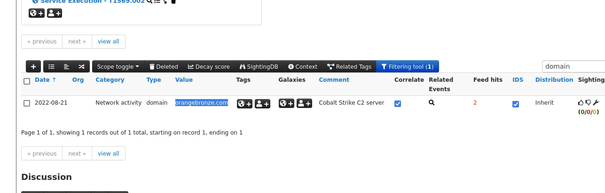

### Operational meaning

A domain alone is only an observable. The C2 context tells the SOC why it matters.

If this intelligence were relevant to my organisation, I would use it to search:

```text
DNS logs       -> Did any host resolve the domain?
Proxy logs     -> Did a user or process request it?
Firewall logs  -> Was a connection attempted or allowed?
EDR telemetry  -> Which process initiated the connection?
SIEM           -> Which host, user and time window are involved?
```

The defensive output is therefore not "I found a malicious domain." It is a **historical or current environment-wide hunt for contact with reported C2 infrastructure**.

I would not automatically block an indicator solely because it exists in a feed. Source, age, confidence, current ownership and potential shared infrastructure would also need to be considered.

## Babuk: intelligence as detection content

The Babuk event contained a YARA rule. One of its strings identified the ransom-note filename:

```text
How To Restore Your Files.txt
```

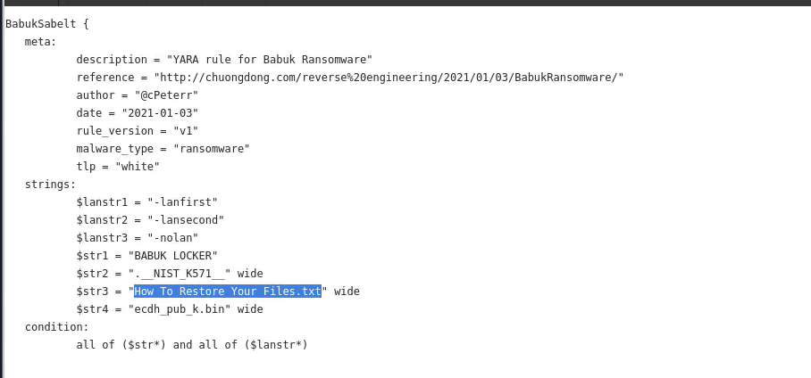

### Operational meaning

This showed that a TIP can store more than network IOCs. Threat intelligence can also provide **detection logic**.

A validated YARA rule could support:

- malware triage;
- scanning collected files;
- memory or forensic hunting where appropriate;
- identifying samples that share characteristic strings or byte patterns.

The rule would still need validation against benign data before production use because broad YARA conditions can produce false positives.

### Defensive lesson

```text
Threat report
     |
     v
MISP intelligence
     |
     +--> IOC -> network/endpoint hunt
     |
     +--> YARA -> file/memory detection opportunity
```

MISP is useful because it can preserve both the indicator and the context needed to decide how that indicator should be used.

---

# Investigation 2 — Turla and behaviour-centric intelligence

## Intelligence requirement

**If intelligence identifies Turla as relevant, how can I move beyond individual IOCs and understand the behaviours I should detect or hunt for?**

I investigated a Turla-related MISP event and opened its ATT&CK Matrix.

The highlighted techniques fell under:

- Persistence
- Privilege Escalation
- Collection

The event included techniques such as Component Object Model Hijacking and Email Collection.

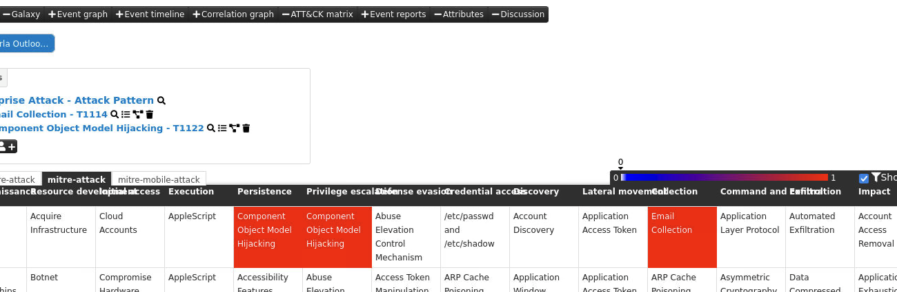

## Pivoting through actor context

I then used the Turla Galaxy/tag relationship to pivot from the current event to other events associated with the same actor. The lab returned 16 related records.

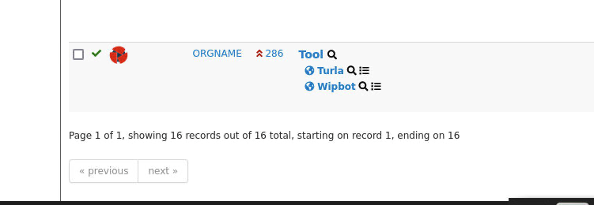

The oldest matching phishing event referenced the decoy document:

```text
Save the Date G20 Digital Economy Taskforce 23 24 October.pdf
```

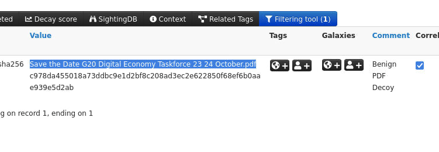

### Operational meaning

This part of the lab demonstrated why CTI should not be limited to IOC matching.

A hash, domain or IP may become obsolete quickly. ATT&CK mappings describe behaviours that can be used to:

- check whether current detections cover the reported techniques;
- determine which logs and telemetry are required;
- build threat-hunting hypotheses;
- compare behaviours across several campaigns;
- communicate the same attacker behaviour consistently between CTI, SOC and detection teams.

The MISP Galaxy/tag pivot also showed how a TIP prevents each report from being treated as an isolated document.

```text
Single event
    |
    v
Threat-actor Galaxy
    |
    v
Related events
    |
    +--> historical campaigns
    +--> malware
    +--> ATT&CK techniques
    +--> indicators
    |
    v
Broader adversary picture
```

If this were an active incident, that broader picture would help me decide **what else to look for after the first suspicious observation**.

---

# Investigation 3 — DDoS and botnet intelligence

## Intelligence requirement

**If availability is critical to the business, how can threat intelligence help identify infrastructure or hosts involved in DDoS activity?**

The investigation covered DDoS booter infrastructure, CoalaBot and the Rhombus Linux botnet.

The relevant DDoS event contained 24 IP-address attributes.

## CoalaBot: enrichment of a malware indicator

A VirusTotal reference linked from the MISP intelligence identified the original filename:

```text
cla.exe
```

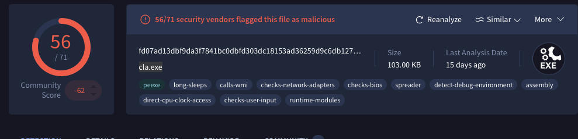

### Operational meaning

A filename is weak evidence by itself because malware can be renamed. It becomes more useful when correlated with:

- SHA256 hashes;
- behaviour;
- network destinations;
- process lineage;
- malware-family context.

This is the purpose of enrichment: **increase the amount of decision-relevant context around an observable**.

## Rhombus: turning malware research into hunting opportunities

The public research referenced by MISP described Rhombus as an ELF installer/dropper targeting Linux and IoT systems. The reported bot client called back to:

```text
209.126.69[.]167:2020
```

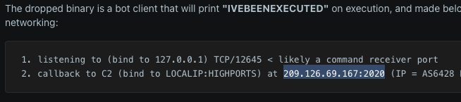

The research also described a local listener on TCP/12645, a dropped ELF payload and persistence involving:

```text
/etc/cron.hourly/0
```

### Operational meaning

The strongest defensive use is not simply blocking one historical C2 address. The report creates several independent detection and hunting opportunities:

```text
Network
  -> outbound connection to reported C2

Filesystem
  -> suspicious ELF written in a temporary location

Persistence
  -> unexpected cron.hourly entry

Process behaviour
  -> unusual shell or remote-command execution

Network service
  -> unexpected local listener on TCP/12645
```

If the attacker changes the C2 address, the behavioural and host-level evidence may still be useful. This is why CTI should combine IOCs with more durable behaviours.

Source used during the exercise:
https://www.reddit.com/r/LinuxMalware/comments/fh3zar/memo_rhombus_an_elf_bot_installerdropper/

---

# Investigation 4 — Mitel MiVoice and Lorenz ransomware

## Intelligence requirement

**If the organisation uses a product reported as exploited in ransomware attacks, how do I determine whether we are exposed and what defenders should do?**

This was the most directly incident-response-oriented part of the lab.

The MISP intelligence connected exploitation of Mitel MiVoice Connect infrastructure with Lorenz ransomware activity.

## Step 1: establish exposure

The exploited vulnerability was:

```text
CVE-2022-29499
```

The referenced reporting identified **MiVoice Connect 19.2 SP3 and earlier**, including earlier 14.x releases, as affected and recommended upgrading to R19.3.

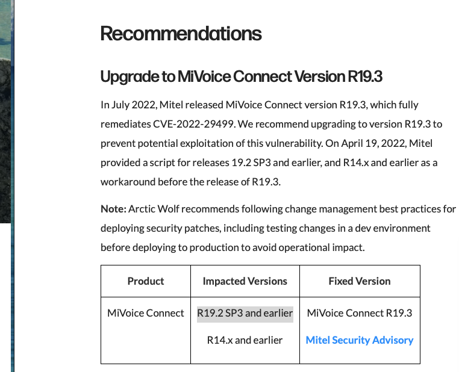

The first operational questions would therefore be:

```text
Do we use MiVoice Connect?
        |
        v
Which versions are deployed?
        |
        v
Is the affected Service Appliance present?
        |
        +--> No  -> document non-exposure
        |
        +--> Yes -> remediate + assess for compromise
```

Patching is only one part of the response. If exploitation may already have occurred, the security team must investigate for evidence of compromise.

## Step 2: find the most relevant intelligence

The MISP search returned more than one MiVoice-related event. I found that the smaller event surfaced the information required for the immediate investigation faster than the much larger event.

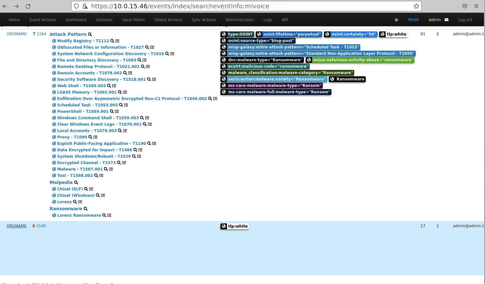

This was an important analyst lesson:

```text
More attributes != more useful intelligence

Useful intelligence = relevance + context + confidence + timeliness
```

A large event may contain extensive ATT&CK mappings, malware relationships and infrastructure, but the correct starting point is the event that best answers the current intelligence requirement.

## Step 3: identify evidence of persistence

The Arctic Wolf reporting referenced through MISP described a webshell used for persistence:

```text
Filename: pdf_import_export.php
Path: /vhelp/pdf/en/
SHA256: 07838ac8fd5a59bb741aae0cf3abf48296677be7ac0864c4f124c2e168c0af94
```

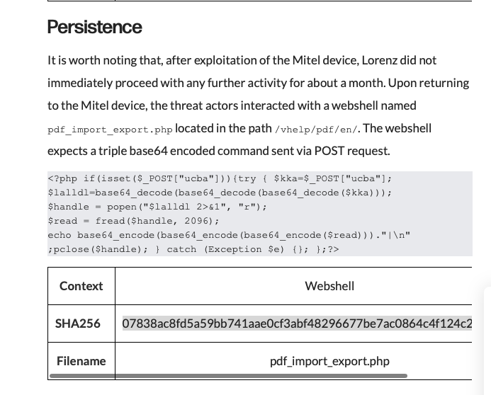

The report stated that the webshell accepted a command via POST and decoded the command from three layers of Base64 before execution. The attackers later returned to the compromised device and continued post-exploitation activity.

MISP's Lorenz ransomware Galaxy described the group as active since at least February 2021.

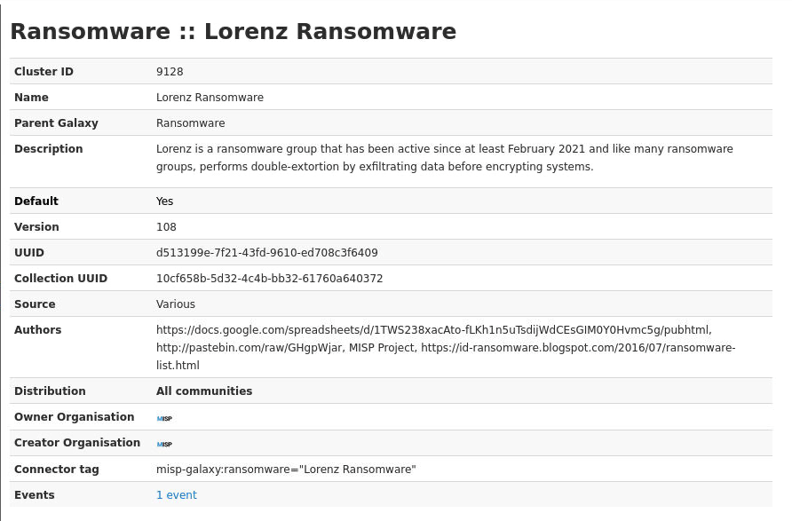

## Step 4: turn the intelligence into a defensive plan

If this were an organisation I was defending, I would translate the intelligence into the following workstreams.

### Vulnerability management

- inventory MiVoice Connect deployments;
- identify affected versions;
- upgrade/remediate vulnerable systems;
- record asset ownership and exposure.

### Compromise assessment

Search the appliance for:

```text
/vhelp/pdf/en/pdf_import_export.php
```

and the reported SHA256.

Then review historical telemetry for activity that occurred **before the patch was applied**, because remediation does not remove an attacker who already obtained a foothold.

### Threat hunting / SOC

Look for evidence consistent with the reported post-exploitation chain:

- suspicious outbound connections from the appliance;
- reverse-shell activity;
- tunnelling or Chisel usage;
- credential access;
- lateral movement from the edge appliance into internal systems;
- unusual data-transfer activity;
- ransomware/encryption behaviour.

### Incident response decision

```text
Vulnerable asset found
        |
        v
Was it exposed during the exploitation window?
        |
        v
Search reported artifacts + historical telemetry
        |
      +---+---+
      |       |
   No evidence   Evidence found
      |       |
   monitor    escalate incident
              contain
              scope
              eradicate
              recover
```

The key lesson is that **threat intelligence should lead to a decision**, not terminate at "this CVE is bad."

Sources used in this investigation:

- Arctic Wolf: https://arcticwolf.com/resources/blog/lorenz-ransomware-chiseling-in/
- Mitel security advisory: https://www.mitel.com/support/security-advisories/mitel-product-security-advisory-22-0002
- CISA Known Exploited Vulnerabilities Catalog: https://www.cisa.gov/known-exploited-vulnerabilities-catalog

---

# What MISP was doing operationally

The lab changed how I think about a TIP. MISP was not simply a database in which I searched for known-bad values.

| MISP capability | What it provides | Defensive use |
|---|---|---|
| Events | Context around a report, campaign or investigation | Understand what the indicators belong to |
| Attributes | Domains, IPs, hashes, filenames and other observables | Search SIEM/EDR/network telemetry |
| Tags | Classification and handling context | Filter and prioritise intelligence |
| Galaxies | Structured actors, malware and ATT&CK knowledge | Pivot across related campaigns and behaviours |
| ATT&CK Matrix | Behavioural mapping | Identify detection coverage and telemetry requirements |
| External references | Link back to underlying research | Validate and enrich MISP data |
| Filtering | Reduce large events to relevant evidence | Improve analyst signal-to-noise |
| Correlation | Connect intelligence across events | Discover relationships not obvious in one report |
| Enrichment | Add malware/reputation/infrastructure context | Improve confidence and triage |

The operational model I took from the lab is:

```text
External intelligence
        |
        v
      MISP
        |
  Search / filter
        |
  Pivot / correlate
        |
 Validate / enrich
        |
        v
Relevant intelligence
        |
 +------+------+---------+
 |             |          |
IOC hunt   Behaviour   Vulnerability
 |             |          |
SIEM/EDR   Detection   Patch + assess
 |             |          |
 +------+------+----------+
        |
        v
Defensive action
```

---

# Analyst takeaways

The most important lessons from the lab were:

1. **Start with an intelligence requirement.** Searching MISP without a concrete question can produce a large amount of data but little decision value.
2. **Context determines whether an indicator is useful.** A domain associated with C2 has more operational value than an unexplained domain string.
3. **Pivoting is fundamental CTI work.** Tags, Galaxies, ATT&CK mappings and external references turn one event into a broader view of the actor or campaign.
4. **More data is not necessarily better intelligence.** The smaller MiVoice event was faster and more relevant for the immediate question than the event with many more attributes.
5. **IOCs should lead to hunts, not just blocklists.** Historical infrastructure can be searched across DNS, proxy, firewall, EDR and SIEM telemetry.
6. **Behaviour gives more durable coverage.** Rhombus persistence/process behaviour and Turla ATT&CK mappings remain useful even when individual indicators change.
7. **Vulnerability intelligence must include compromise assessment.** Patching an exploited edge device is not sufficient if persistence may already exist.
8. **The final product of CTI is a decision.** Hunt, detect, patch, investigate, contain, monitor or report.

---

# Skills demonstrated

- MISP event and attribute investigation
- intelligence-requirement-driven research
- threat-intelligence search and filtering
- IOC extraction and defanging
- MISP Galaxy and tag pivoting
- MITRE ATT&CK interpretation
- external-source validation and enrichment
- YARA-rule interpretation
- malware and botnet research
- C2 and persistence identification
- vulnerability-intelligence analysis
- ransomware intrusion analysis
- signal-to-noise and relevance assessment
- translating CTI into SOC hunts and detection opportunities
- translating vulnerability intelligence into remediation and compromise-assessment actions

---

# Outcome

The lab demonstrated a complete defensive CTI thought process:

> **Given a possible incident or security concern, locate relevant intelligence in MISP, determine what it means in context, validate it, and translate it into concrete defensive action.**

The value was not the twelve lab answers. The value was learning how to move from **external intelligence -> internal investigation -> defensive decision**.

This experience also provides the MISP component for my broader financial-sector threat-informed detection work, where MISP can serve as an intelligence input layer for ATT&CK mapping, telemetry selection and validated SIEM detection development.

## Safety note

All investigation activity was performed in the controlled BTL1 training environment or against public threat-intelligence reporting. Potentially malicious domains and IP addresses are defanged where appropriate. No credentials or malware samples are published.